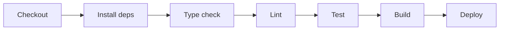

# CI/CD Pipeline Documentation

**IAFACTORY - Continuous Integration and Deployment Documentation**

*Last updated: January 19, 2026*

---

## Table of Contents

1. [Overview](#1-overview)
2. [GitHub Actions](#2-github-actions)
3. [Environments](#3-environments)
4. [Build Pipeline](#4-build-pipeline)
5. [Automated Tests](#5-automated-tests)
6. [Deployment](#6-deployment)
7. [Monitoring](#7-monitoring)
8. [Rollback](#8-rollback)

---

## 1. Overview

### CI/CD Architecture

```
┌─────────────────────────────────────────────────────────────────┐
│                        GitHub Repository                         │
└───────────────────────────────┬─────────────────────────────────┘
                                │
                                ▼
┌─────────────────────────────────────────────────────────────────┐
│                        GitHub Actions                            │
│  ┌─────────────┐  ┌─────────────┐  ┌─────────────┐             │
│  │   Lint &    │  │    Build    │  │    Test     │             │
│  │  TypeCheck  │  │             │  │             │             │
│  └──────┬──────┘  └──────┬──────┘  └──────┬──────┘             │
│         └─────────────────┼─────────────────┘                   │
│                           ▼                                      │
│                  ┌─────────────┐                                │
│                  │   Deploy    │                                │
│                  └──────┬──────┘                                │
└─────────────────────────┼───────────────────────────────────────┘
                          │
          ┌───────────────┼───────────────┐
          ▼               ▼               ▼
    ┌──────────┐   ┌──────────┐   ┌──────────┐
    │  Vercel  │   │  Staging │   │Production│
    │ Preview  │   │   VPS    │   │   VPS    │
    └──────────┘   └──────────┘   └──────────┘
```

### Branches

| Branch | Environment | Deployment |
|--------|-------------|------------|
| `main` | - | None (protected) |
| `next` | Staging | Automatic |
| `release/*` | Production | Manual (approval) |
| `feat/*` | Preview | Automatic (Vercel) |

---

## 2. GitHub Actions

### 2.1 Main Workflows

```yaml
# .github/workflows/ci.yml
name: CI

on:
  push:
    branches: [next, main]
  pull_request:
    branches: [next, main]

concurrency:
  group: ${{ github.workflow }}-${{ github.ref }}
  cancel-in-progress: true

jobs:
  lint:
    name: Lint & Type Check
    runs-on: ubuntu-latest
    steps:
      - uses: actions/checkout@v4

      - name: Setup pnpm
        uses: pnpm/action-setup@v2
        with:
          version: 10

      - name: Setup Node.js
        uses: actions/setup-node@v4
        with:
          node-version: '20'
          cache: 'pnpm'

      - name: Install dependencies
        run: pnpm install --frozen-lockfile

      - name: Type check
        run: pnpm run type-check

      - name: Lint
        run: pnpm run lint

  test:
    name: Tests
    runs-on: ubuntu-latest
    needs: lint
    steps:
      - uses: actions/checkout@v4

      - name: Setup pnpm
        uses: pnpm/action-setup@v2
        with:
          version: 10

      - name: Setup Node.js
        uses: actions/setup-node@v4
        with:
          node-version: '20'
          cache: 'pnpm'

      - name: Install dependencies
        run: pnpm install --frozen-lockfile

      - name: Run tests
        run: pnpm run test:ci

      - name: Upload coverage
        uses: codecov/codecov-action@v3
        with:
          files: ./coverage/lcov.info

  build:
    name: Build
    runs-on: ubuntu-latest
    needs: [lint, test]
    steps:
      - uses: actions/checkout@v4

      - name: Setup pnpm
        uses: pnpm/action-setup@v2
        with:
          version: 10

      - name: Setup Node.js
        uses: actions/setup-node@v4
        with:
          node-version: '20'
          cache: 'pnpm'

      - name: Install dependencies
        run: pnpm install --frozen-lockfile

      - name: Build
        run: pnpm run build
        env:
          NEXT_PUBLIC_API_URL: ${{ secrets.NEXT_PUBLIC_API_URL }}

      - name: Upload build artifact
        uses: actions/upload-artifact@v4
        with:
          name: build
          path: .next
          retention-days: 7
```

### 2.2 Deployment Workflow

```yaml
# .github/workflows/deploy.yml
name: Deploy

on:
  push:
    branches: [next]
  workflow_dispatch:
    inputs:
      environment:
        description: 'Environment to deploy to'
        required: true
        default: 'staging'
        type: choice
        options:
          - staging
          - production

jobs:
  deploy-staging:
    name: Deploy to Staging
    runs-on: ubuntu-latest
    if: github.ref == 'refs/heads/next' || github.event.inputs.environment == 'staging'
    environment:
      name: staging
      url: https://staging.iafactory.ai

    steps:
      - uses: actions/checkout@v4

      - name: Deploy to Staging VPS
        uses: appleboy/ssh-action@v1.0.0
        with:
          host: ${{ secrets.STAGING_HOST }}
          username: ${{ secrets.STAGING_USER }}
          key: ${{ secrets.STAGING_SSH_KEY }}
          script: |
            cd /var/www/iafactory
            git pull origin next
            pnpm install --frozen-lockfile
            pnpm run build
            pm2 restart iafactory-staging

      - name: Notify Slack
        uses: 8398a7/action-slack@v3
        with:
          status: ${{ job.status }}
          fields: repo,commit,author,action
        env:
          SLACK_WEBHOOK_URL: ${{ secrets.SLACK_WEBHOOK }}

  deploy-production:
    name: Deploy to Production
    runs-on: ubuntu-latest
    if: github.event.inputs.environment == 'production'
    environment:
      name: production
      url: https://app.iafactory.ai

    steps:
      - uses: actions/checkout@v4

      - name: Deploy to Production VPS
        uses: appleboy/ssh-action@v1.0.0
        with:
          host: ${{ secrets.PROD_HOST }}
          username: ${{ secrets.PROD_USER }}
          key: ${{ secrets.PROD_SSH_KEY }}
          script: |
            cd /var/www/iafactory
            git fetch --all
            git checkout ${{ github.sha }}
            pnpm install --frozen-lockfile
            pnpm run build
            pm2 restart iafactory-prod

      - name: Create Release
        uses: actions/create-release@v1
        env:
          GITHUB_TOKEN: ${{ secrets.GITHUB_TOKEN }}
        with:
          tag_name: v${{ github.run_number }}
          release_name: Release ${{ github.run_number }}
          draft: false
          prerelease: false
```

---

## 3. Environments

### 3.1 Environment Configuration

| Variable | Development | Staging | Production |
|----------|-------------|---------|------------|
| `NODE_ENV` | development | production | production |
| `NEXT_PUBLIC_API_URL` | localhost:3000 | staging.api.iafactory.ai | api.iafactory.ai |
| `DATABASE_URL` | local postgres | staging DB | prod DB |
| `LOG_LEVEL` | debug | info | warn |

### 3.2 Environment Files

```bash
# Structure
.env.local          # Local (not committed)
.env.development    # Development
.env.staging        # Staging
.env.production     # Production (secrets in GitHub)
```

### 3.3 GitHub Environments

```yaml
# Configuration in Settings > Environments

# Staging
- Required reviewers: 0
- Wait timer: 0 minutes
- Deployment branches: next

# Production
- Required reviewers: 2
- Wait timer: 5 minutes
- Deployment branches: release/*
```

---

## 4. Build Pipeline

### 4.1 Build Steps



### 4.2 Optimizations

```yaml
# Cache pnpm
- name: Get pnpm store directory
  shell: bash
  run: echo "STORE_PATH=$(pnpm store path --silent)" >> $GITHUB_ENV

- uses: actions/cache@v4
  with:
    path: ${{ env.STORE_PATH }}
    key: ${{ runner.os }}-pnpm-store-${{ hashFiles('**/pnpm-lock.yaml') }}
    restore-keys: |
      ${{ runner.os }}-pnpm-store-

# Cache Next.js
- uses: actions/cache@v4
  with:
    path: ${{ github.workspace }}/.next/cache
    key: ${{ runner.os }}-nextjs-${{ hashFiles('**/pnpm-lock.yaml') }}-${{ hashFiles('**/*.ts', '**/*.tsx') }}
    restore-keys: |
      ${{ runner.os }}-nextjs-${{ hashFiles('**/pnpm-lock.yaml') }}-
```

---

## 5. Automated Tests

### 5.1 Vitest Configuration

```typescript
// vitest.config.ts
import { defineConfig } from 'vitest/config';
import react from '@vitejs/plugin-react';
import path from 'path';

export default defineConfig({
  plugins: [react()],
  test: {
    environment: 'jsdom',
    globals: true,
    setupFiles: ['./tests/setup.ts'],
    include: ['**/*.test.{ts,tsx}'],
    coverage: {
      provider: 'v8',
      reporter: ['text', 'lcov'],
      exclude: ['node_modules', 'tests', '**/*.d.ts'],
    },
  },
  resolve: {
    alias: {
      '@': path.resolve(__dirname, './src'),
    },
  },
});
```

### 5.2 CI Tests

```json
// package.json
{
  "scripts": {
    "test": "vitest",
    "test:ci": "vitest run --coverage --reporter=verbose",
    "test:e2e": "playwright test"
  }
}
```

---

## 6. Deployment

### 6.1 Vercel (Preview)

```json
// vercel.json
{
  "buildCommand": "pnpm run build",
  "outputDirectory": ".next",
  "framework": "nextjs",
  "regions": ["cdg1"],
  "env": {
    "NEXT_PUBLIC_API_URL": "@api_url"
  }
}
```

### 6.2 VPS (Staging/Production)

```bash
# Deployment script
#!/bin/bash
# scripts/deploy.sh

set -e

echo "Starting deployment..."

# Pull latest code
git pull origin $BRANCH

# Install dependencies
pnpm install --frozen-lockfile

# Build
pnpm run build

# Run migrations
pnpm run db:migrate

# Restart application
pm2 restart ecosystem.config.js

echo "Deployment complete!"
```

### 6.3 PM2 Configuration

```javascript
// ecosystem.config.js
module.exports = {
  apps: [
    {
      name: 'iafactory-web',
      script: 'node_modules/.bin/next',
      args: 'start -p 3000',
      instances: 'max',
      exec_mode: 'cluster',
      env: {
        NODE_ENV: 'production',
      },
      env_staging: {
        NODE_ENV: 'production',
        PORT: 3010,
      },
    },
  ],
};
```

---

## 7. Monitoring

### 7.1 Health Checks

```yaml
# Monitoring workflow
name: Health Check

on:
  schedule:
    - cron: '*/5 * * * *'  # Every 5 minutes

jobs:
  health:
    runs-on: ubuntu-latest
    steps:
      - name: Check Production
        run: |
          response=$(curl -s -o /dev/null -w "%{http_code}" https://app.iafactory.ai/api/health)
          if [ $response != "200" ]; then
            echo "Health check failed with status $response"
            exit 1
          fi

      - name: Alert on failure
        if: failure()
        uses: 8398a7/action-slack@v3
        with:
          status: failure
          text: 'Production health check failed!'
        env:
          SLACK_WEBHOOK_URL: ${{ secrets.SLACK_WEBHOOK }}
```

---

## 8. Rollback

### 8.1 Automatic Rollback

```yaml
# Rollback workflow
name: Rollback

on:
  workflow_dispatch:
    inputs:
      environment:
        description: 'Environment to rollback'
        required: true
        type: choice
        options:
          - staging
          - production
      commit:
        description: 'Commit SHA to rollback to'
        required: true

jobs:
  rollback:
    runs-on: ubuntu-latest
    environment: ${{ github.event.inputs.environment }}

    steps:
      - name: Rollback
        uses: appleboy/ssh-action@v1.0.0
        with:
          host: ${{ secrets[format('{0}_HOST', upper(github.event.inputs.environment))] }}
          username: ${{ secrets[format('{0}_USER', upper(github.event.inputs.environment))] }}
          key: ${{ secrets[format('{0}_SSH_KEY', upper(github.event.inputs.environment))] }}
          script: |
            cd /var/www/iafactory
            git fetch --all
            git checkout ${{ github.event.inputs.commit }}
            pnpm install --frozen-lockfile
            pnpm run build
            pm2 restart all

      - name: Notify
        uses: 8398a7/action-slack@v3
        with:
          status: custom
          custom_payload: |
            {
              "text": "Rollback completed to ${{ github.event.inputs.commit }} on ${{ github.event.inputs.environment }}"
            }
        env:
          SLACK_WEBHOOK_URL: ${{ secrets.SLACK_WEBHOOK }}
```

### 8.2 Manual Procedure

```bash
# In case of emergency
ssh user@production-server

cd /var/www/iafactory

# View recent commits
git log --oneline -10

# Rollback to previous commit
git checkout HEAD~1

# Rebuild
pnpm run build

# Restart
pm2 restart all

# Verify
curl -I https://app.iafactory.ai/api/health
```

---

## Contact

For CI/CD questions:
- DevOps: devops@iafactory.ai
- Slack: #devops
